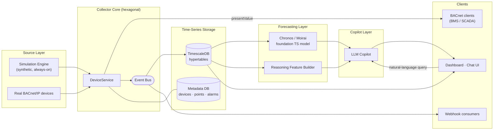
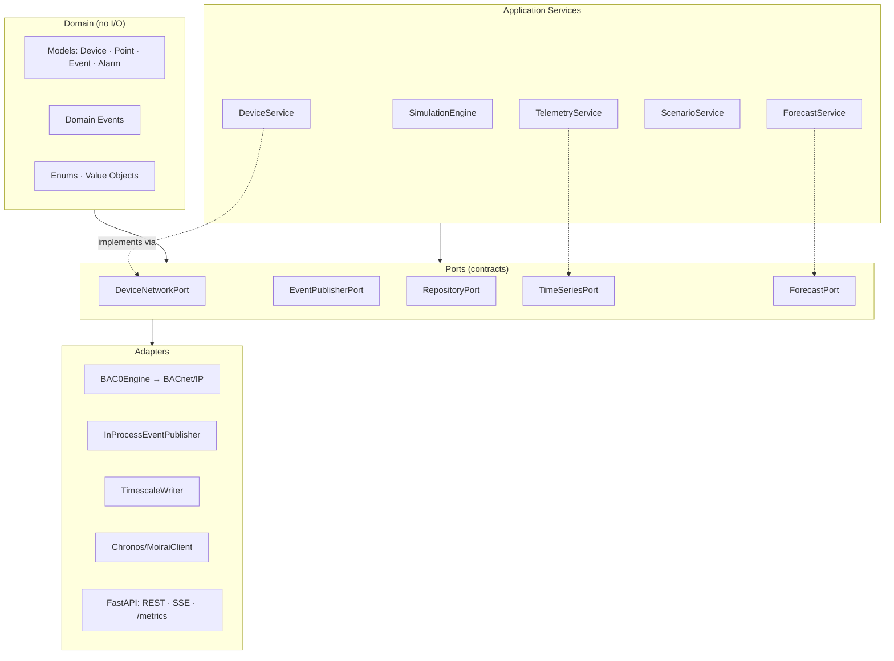
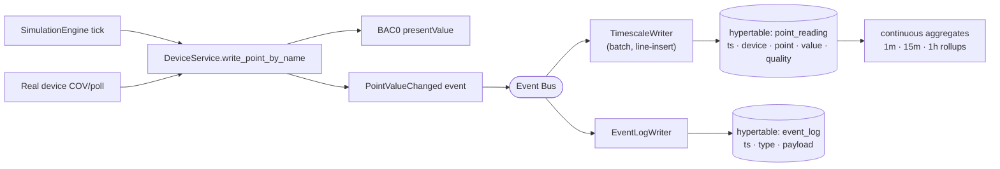
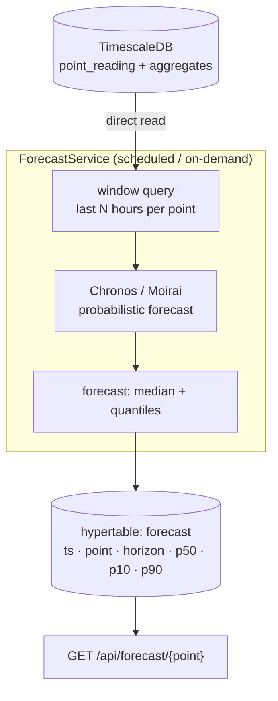
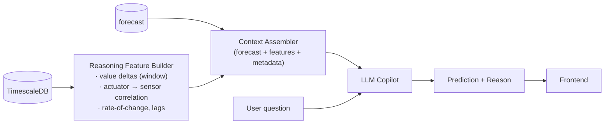
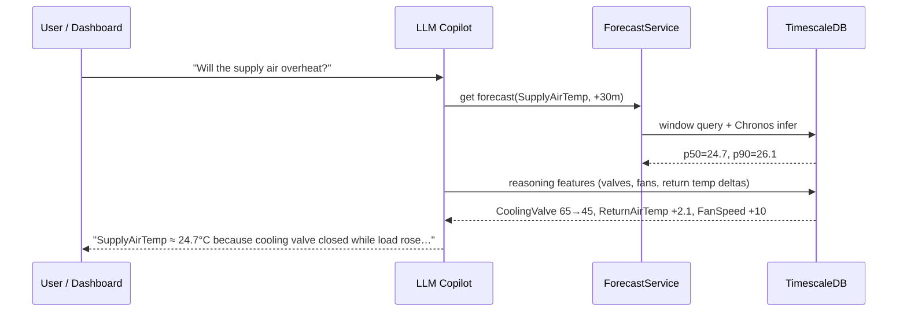
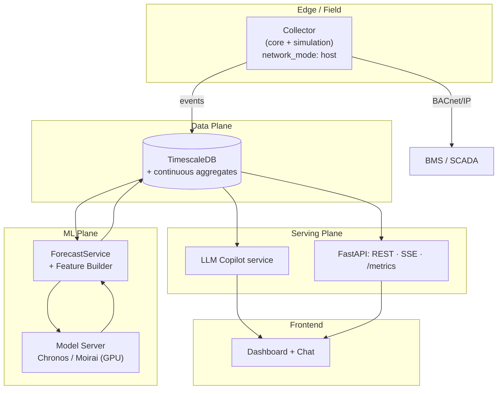
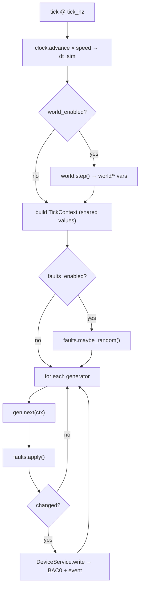
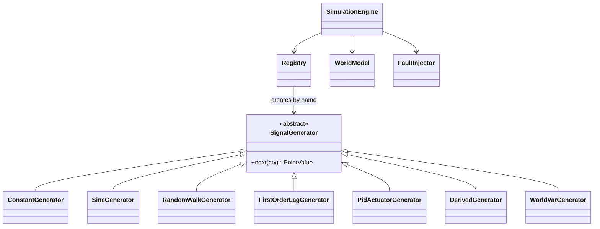
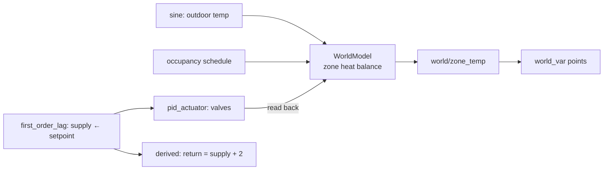

# Architecture

BACnet Lab is a **hexagonal** (ports & adapters) modular monolith at its core, extended with a **time-series + ML forecasting + LLM copilot** pipeline. Business logic stays free of infrastructure; every external concern (BACnet wire, storage, models, UI) plugs in behind a contract.

This document is diagram-first: each layer is shown as a mermaid graph rather than a folder listing, so the design reads as a scalable system, not a file tree.

---

## 1. System Overview



**Read it as four stages:** devices produce data → core normalizes and fans it out → TimescaleDB persists every reading/event → models forecast and the copilot explains. Each stage is an independent, separately-scalable service.

---

## 2. Core (Collector) — Hexagonal Layers

The BACnet core is unchanged hexagonal: domain at the center, ports as contracts, adapters on the edge.



**Rule:** the domain imports nothing outward. Adapters depend on ports, never the reverse — so TimescaleDB, Chronos, or the LLM can each be swapped without touching business logic.

| Port | Contract | Adapter |
|------|----------|---------|
| `DeviceNetworkPort` | start/stop devices, read/write points | `BAC0Engine` (BACpypes3) |
| `EventPublisherPort` | publish/subscribe domain events | in-process bus |
| `RepositoryPort` | persist devices/endpoints/alarms | metadata DB |
| `TimeSeriesPort` | append + window-query readings | `TimescaleWriter` |
| `ForecastPort` | request/store forecasts | `Chronos/MoiraiClient` |

---

## 3. Ingestion → Time-Series Storage

Every point change and event flows through the event bus into **TimescaleDB** as append-only hypertables. This is the system of record the models read from.



**Schema (TimescaleDB):**

| Hypertable | Key columns | Purpose |
|------------|-------------|---------|
| `point_reading` | `time, device_id, point, value, quality` | every numeric reading |
| `event_log` | `time, event_type, device_id, payload` | alarms, status, scenarios |
| continuous aggregates | `time_bucket` 1m/15m/1h | downsampled history for fast queries + model input |

Design notes:
- **Hypertable partitioning** by time → fast range scans, cheap retention drops.
- **Continuous aggregates** give the forecaster clean, regular-interval series without on-the-fly resampling.
- Metadata (friendly names, units, thresholds) stays in a relational table — never as high-cardinality TS tags.

---

## 4. Forecasting Layer — Chronos / Moirai

A forecasting service with **direct read access** to TimescaleDB pulls recent windows per point, runs a **foundation time-series model** (Amazon **Chronos** or Salesforce **Moirai** — zero-shot, no per-point training), and writes forecasts back.



- **Zero-shot** — Chronos/Moirai forecast unseen series without training, so any new point or scaled device is covered immediately.
- **Probabilistic** — store quantiles (p10/p50/p90), not just a point estimate, so the copilot can express confidence.
- **Direct DB access** — the model reads hypertables directly (or via the continuous aggregates) for low-latency batched inference; forecasts are persisted for serving + backtesting.
- **Model server** — runs as its own service (GPU-capable), scaled independently of the collector.

---

## 5. Reasoning Features + LLM Copilot

The forecast says *what*; the copilot says *why*. A **Reasoning Feature Builder** computes recent deltas and cross-point correlations; the **LLM Copilot** turns forecast + features into a natural-language prediction and explanation.



**Example output:**

```
Prediction:
  SupplyAirTemp = 24.7 °C  (p50, +30 min)

Reason:
  CoolingValve dropped 65% → 45%
  ReturnAirTemp increased 2.1 °C
  FanSpeed increased 10%
```

How that is produced:



- Features are **deterministic** (computed in SQL/Python), so the LLM explains real numbers rather than hallucinating causes.
- The copilot is **grounded**: every claim cites a stored reading or forecast quantile.
- Query path: UI → copilot → ForecastService/TimescaleDB → grounded answer.

---

## 6. Scalable Deployment

Each layer is a separate, independently-scaled service; TimescaleDB and the model server are the stateful anchors.



**Scaling levers:**

| Component | Scale strategy |
|-----------|----------------|
| Collector | one process per protocol/site; horizontal by device range |
| TimescaleDB | hypertable partitioning, continuous aggregates, multi-node for very high cardinality |
| Model server | stateless GPU replicas behind a queue; batch inference |
| ForecastService | horizontal workers, per-point sharding |
| LLM Copilot | stateless replicas; cache grounded contexts |
| FastAPI / UI | stateless, load-balanced |

---

## 7. Simulation Engine (data source detail)

`SimulationEngine` is always-on (`BACNET_LAB_SIM_AUTOSTART`): each tick it advances simulated time, optionally steps world physics, runs one signal generator per point, applies faults, and writes changes through `DeviceService` — feeding the same pipeline real devices would.



Signal models (per point, strategy pattern, self-registered):



| Model | Behavior |
|-------|----------|
| `constant` / `gaussian_noise` | fixed value ± noise |
| `sine` | diurnal sinusoid |
| `random_walk` | bounded Brownian drift, mean-reverting |
| `first_order_lag` | exponential approach to a target / target point |
| `ramp` / `step` (`square`) | linear ramp / duty-cycle square wave |
| `pid_actuator` | closed-loop output tracking a setpoint |
| `derived` | `value = f(other points)` via safe expression |
| `multistate_cycle` | discrete state rotation |
| `world_var` | reads a `WorldModel` zone variable |

Coupling (world physics + closed loops) makes the data physically correlated — which is exactly what the forecaster needs to learn realistic relationships:



Full env-var catalog and design rationale: [realtime-simulation-architecture.md](realtime-simulation-architecture.md).

---

## 8. Key Design Decisions

- **Async throughout** — BAC0/BACpypes3, FastAPI, and DB I/O are all `async`; no thread offloading.
- **One BAC0 instance per device** — each device on its own UDP port (from 47808); mirrors real BACnet, independent lifecycle.
- **Event bus decoupling** — persistence, webhooks, TS writer, and telemetry subscribe independently; one handler failing never affects others.
- **Time-series as system of record** — TimescaleDB hypertables hold every reading/event; the relational metadata DB holds names/units/thresholds.
- **Zero-shot forecasting** — Chronos/Moirai need no per-point training, so new/scaled points are covered instantly.
- **Grounded copilot** — the LLM only explains stored numbers (forecasts + computed features), never invents causes.
- **Config over code** — devices, signal models, and simulation behavior are YAML + env; adding data needs no code change.

---

## 9. Testing Strategy

- **Unit** — domain objects directly; generators/feature builders are pure functions, table-driven tests.
- **Integration** — swap `BAC0Engine` for a fake network; assert the chain device → event → TimescaleDB → forecast → API.
- **Model** — backtest forecasts against held-out hypertable windows (MASE/quantile loss); no live hardware needed.
- **Copilot** — assert every explanation cites a real reading/forecast (grounding check).
